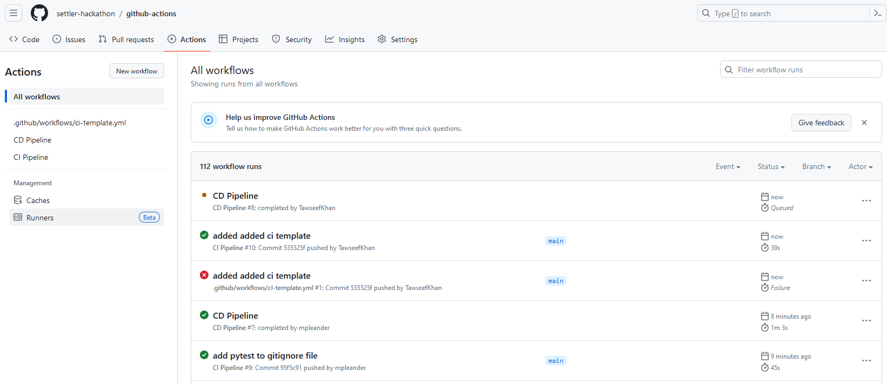
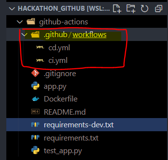
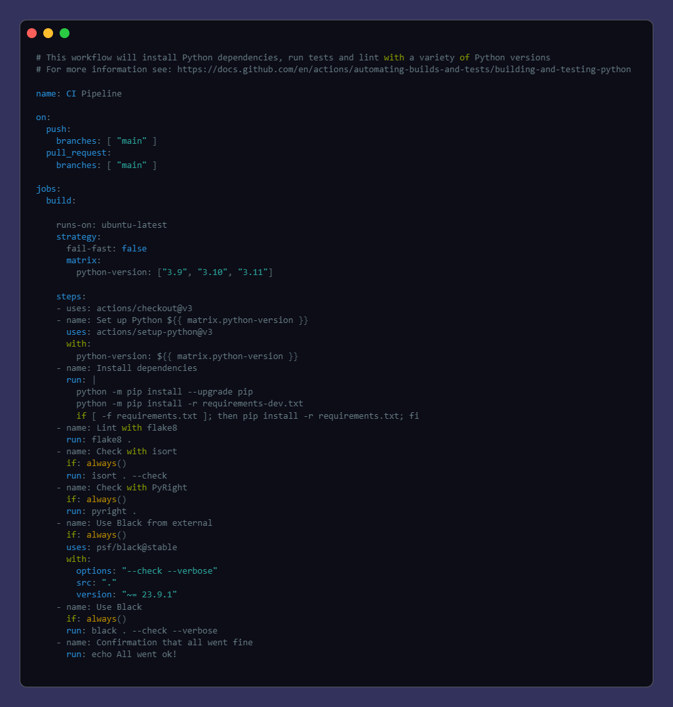
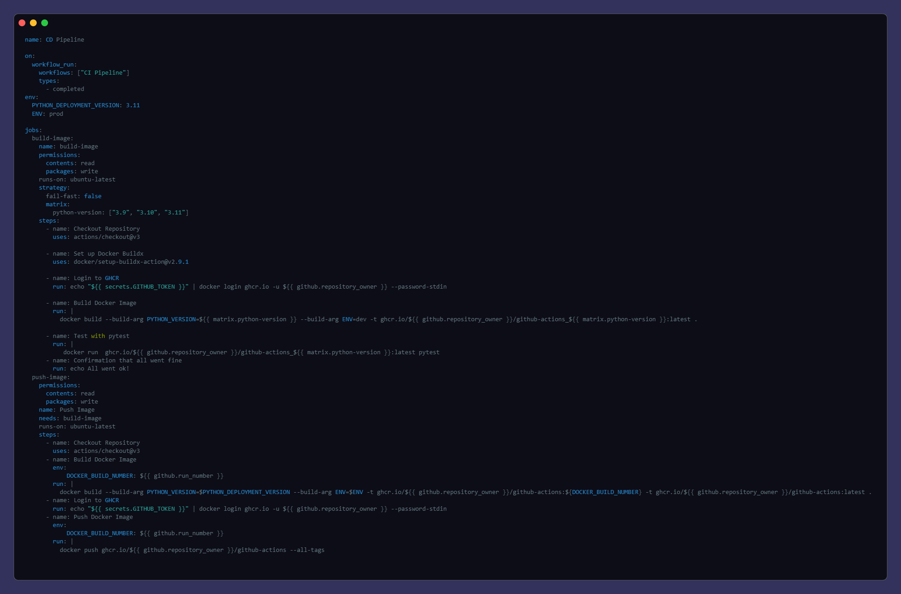

# Why GHA
- Ørsted is moving to **Github** soon anyway
- CiCd scripts needs **improvement**. 
- Moving to GitHub => **simplify** our CiCD
- GHA has very large **community**
- Introducing ***templates***

---

### Github Actions in Action

---

### How to work with Github Actions?

---

### Where are the actions(pipelines)?

---

### How to start

---

### Basic CI pipeline

    

---

### Basic CD pipeline

    

